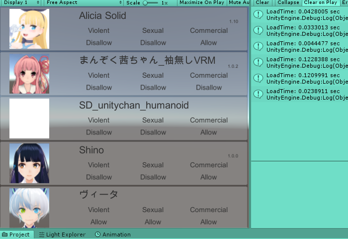

# VRMQuickMetaLoader
load quick VRM.Meta information



## Usage

### Just Simple.

```csharp
var bytes = File.ReadAllBytes(file);
var metaLoader = new VRM.QuickMetaLoader.MetaLoader(bytes);
VRMMetaObject meta = metaLoader.Read(true);
```

And, you got VRMMetaObject with thumbnail.

### Thumbnail on your hands

```csharp
var bytes = File.ReadAllBytes(file);
var metaLoader = new VRM.QuickMetaLoader.MetaLoader(bytes);
VRMMetaObject meta = metaLoader.Read();  // without thumbnail but fast

// some process...

Texture2D thumbnail = metaLoader.LoadThumbnail();
```

### Async Read

You can also use Async Method

```csharp
var bytes = await Task.Run(() => File.ReadAllBytes(file));
var metaLoader = new MetaLoader(bytes);
VRMMetaObject meta = await metaLoader.ReadAsync(true);
```

## License

MIT License

## Download

Go [GitHub Release page](https://github.com/m2wasabi/VRMQuickMetaLoader/releases)
  and get .unitypackage

## Dependencies

 + UniVRM 0.53.0 : [https://github.com/vrm-c/UniVRM/releases](https://github.com/vrm-c/UniVRM/releases)

## Also recommended

 + VRMLoaderUI : [https://github.com/m2wasabi/VRMLoaderUI](https://github.com/m2wasabi/VRMLoaderUI)
